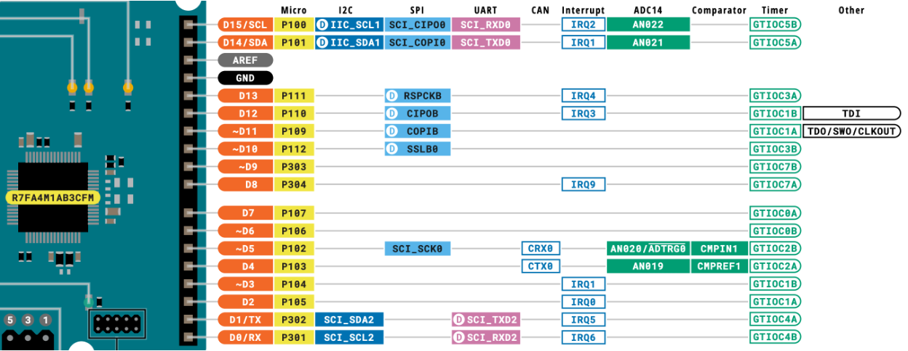
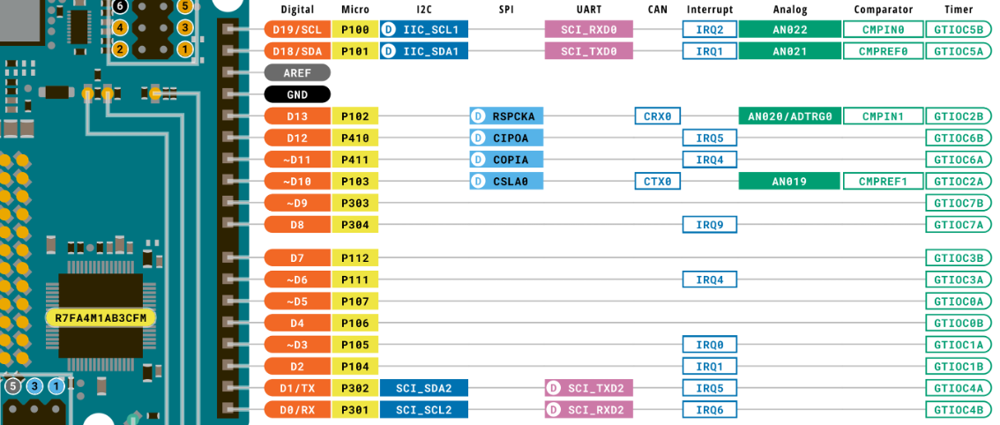

# RA4M1_QuadratureEncoder

Arduino library for counting encoders using the GPT phase counter function of the Renesas RA4M1 microcontroller.

[日本語 (Japanese)](README_JP.md)

## Supported frameworks and devices 

- Arduino IDE / PlatformIO
- Renesas RA4M1 based boards\
 (e.g., Arduino UNO R4 Minima, Arduino UNO R4 WiFi)

## Pin assignment chart

| GPT CH | PinA / PinB | R4-Minima Pin | R4-WiFi Pin |
|---:|---|---|---|
| 0 (32bit) | P107 / P106 | D7 / D6 | D5 / D4 |
| 1 (32bit) | P105, P109 / P104, P110 | D2, D11 / D3, D12 | D3 / D2 |
| 2 (16bit) | P103 / P102 | D4 / D5 | D10 / D13 |
| 3 (16bit) | P111 / P112 | D13 / D10 | D6 / D7 |
| 4 (16bit) | P302 / P301 | D1 / D0 | D1 / D0 |
| 5 (16bit) | P100 / P101 | D15 / D14 | D15 / D14 |
| 6 (16bit) | P411 / P410 | - / - | D11 / D12 |
| 7 (16bit) | P304 / P303 | D8 / D9 | D8 / D9 |

Arduino official boards pinout

<figure>
  
  <figcaption>Arduino UNO R4 Minima</figcaption>
</figure>

<figure>
  
  <figcaption>Arduino UNO R4 WiFi</figcaption>
</figure>

## API

### `QuadratureEncoder(uint8_t timer_ch, uint16_t pinA, uint16_t pinB)`

Creates an encoder instance for the specified GPT channel.

- `timer_ch`: GPT channel number from **0 to 7**
- `pinA`, `pinB`: RA4M1 port/pin values such as `105` or `PORT_PIN(1, 5)`

### `begin()`

Initializes the GPT and I/O pins, then starts counting.

### `read()`

Returns the current counter value as `int32_t`.

### `write(int32_t value)`

Sets the counter to the specified value.

## ⚠️ Disclaimer

- **Direct hardware pin control:**
    The library configures the GTIOCxA/B function by modifying the register of the specified pin. After executing `begin()`, the pin will be dedicated exclusively to encoder input.
- **Timer conflicts with other libraries:**
    Please ensure that the GPT channel you are using does not conflict with other libraries (such as servo control).
- **Pin mapping differences:**
    Internal routing may vary depending on the board. Please refer to the schematic or datasheet for your specific board, such as Minima or WiFi.
- **Handling of samples:**
    Sample sketches are for reference only. Please adjust them to match your wiring and encoder specifications (such as whether pull-up resistors are required).
- **Pre-checking Pins:**
    Before calling `begin()`, verify that the target pin is not already in use by other peripherals or libraries.

## License

This project is licensed under the MIT License - see the [LICENSE](LICENSE) file for details.